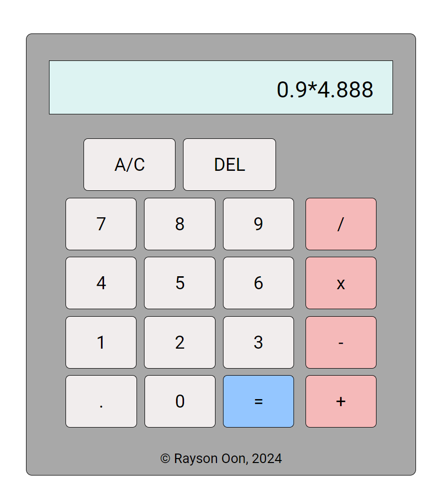

# Calculator
A calculator webapp that computes basic operations. Access the project [here](https://raysonoon.github.io/calculator/)

## How to use
1. Click on desired digits for your first number
2. Click on a operator button (/, x, -, +)
3. Click on desired digits for your second number
4. Click equal button (=) or another operator button to compute

## Features
- Decimal numbers
- A/C to clear display
- Del to remove last digit

## Skills
- Javascript, HTML, CSS

## What the app looks like
